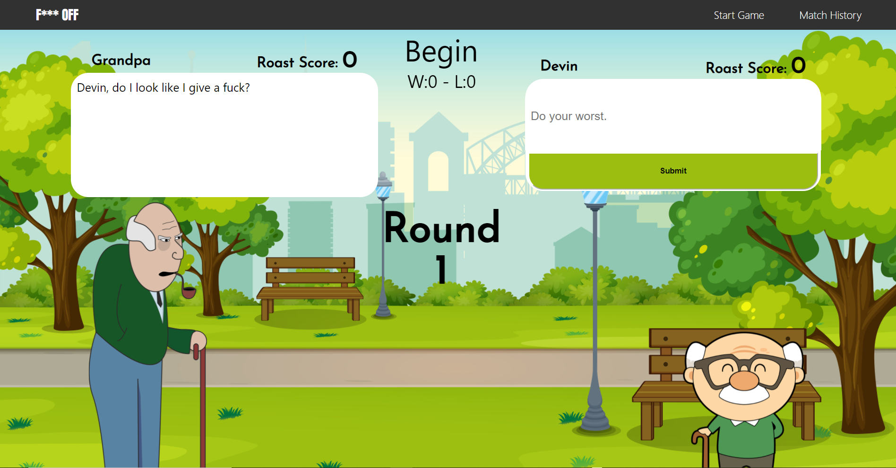

# F*** Off Grandpa

**Old Man Roast Match!**

 

### So What's Going On?
F*** Off Grandpa is a roasting tournament between two elderly men. They go through 3 round matches delivering insults.
Insults are scored by the disrespect rating system. This system takes in keywords and scores them with there own set score.

Give it a try.
(link)

### Have a look
This is a solo project I built in react. It is designed with CSS and
Flexbox. The logic for the game was written in JavaScript and the
insults come from FOAAS API.

(screenshots)

### What did I use to create this masterpiece 

- Languages:
  - React
  - Javascript
  - HTML
  - CSS (Flexbox)

- APIs:
  - https://www.foaas.com/
